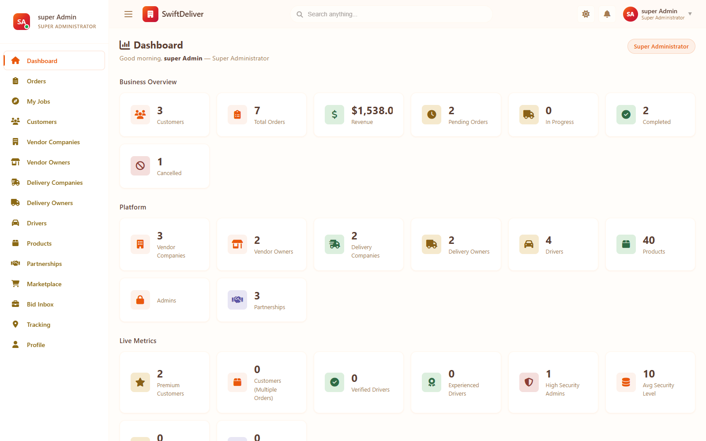
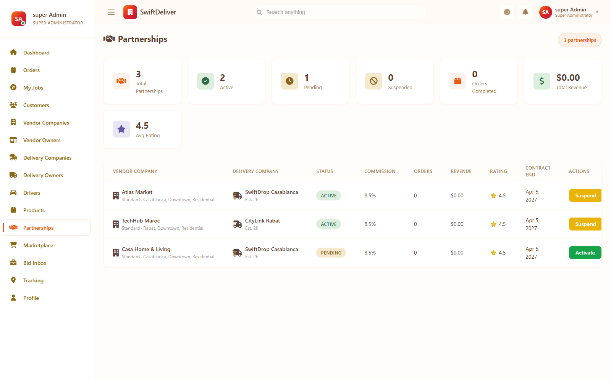
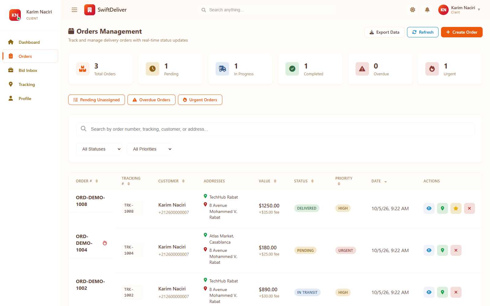
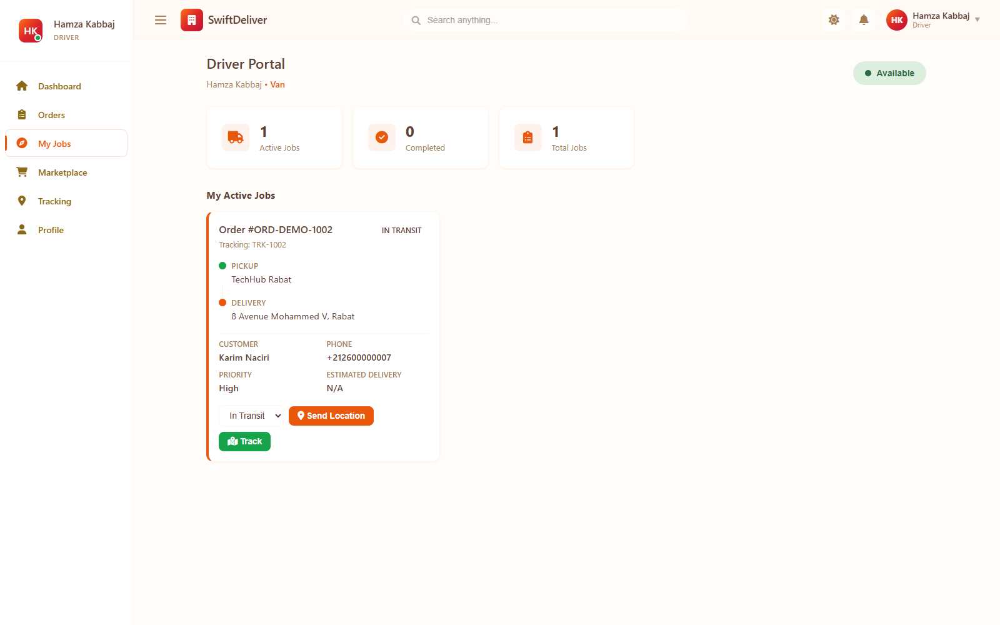
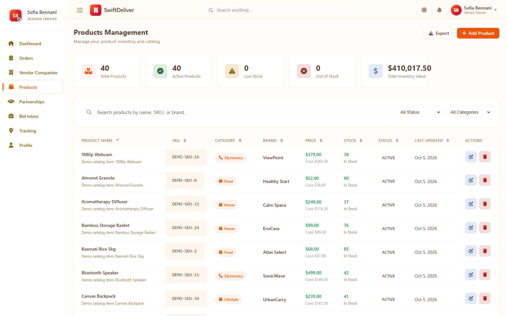
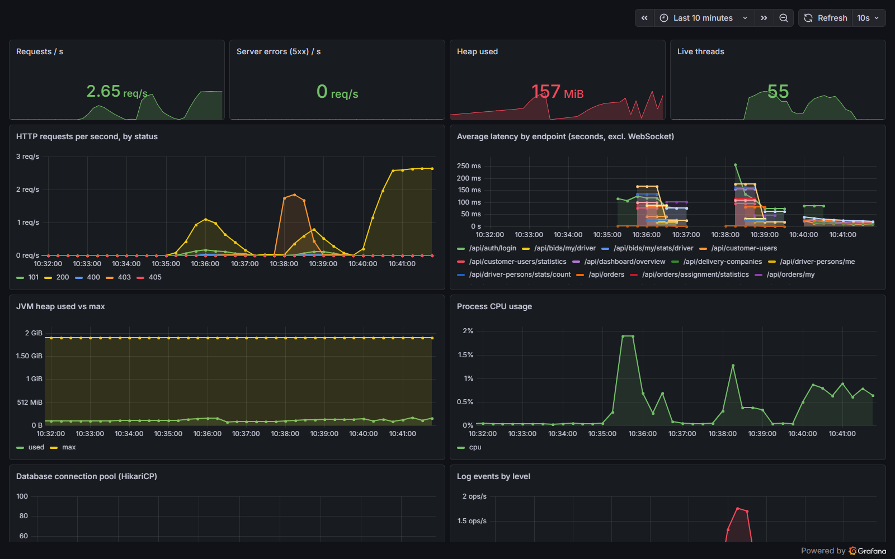
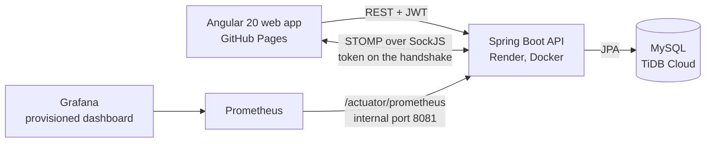

# SwiftDeliver

A multi-tenant delivery marketplace. Vendors list products and create delivery orders; delivery companies get those orders through a partnership, an automatic assignment engine or open bidding; drivers move the order through its lifecycle and report their position; customers follow it live. One platform, five kinds of user, each seeing only their own slice of the data.

**Spring Boot 4.1 · Java 17 (runs on Java 21) · MySQL · JWT · STOMP/WebSocket · Angular 20 · Docker · Prometheus + Grafana**

## Live demo

**https://majdabbassi.github.io/delivery-platform/** (web app on GitHub Pages, API on Render, MySQL on TiDB Cloud, all free tiers)

Sign in with a [demo account](#demo-accounts), for example `customer.karim` / `SwiftDeliver@2026!`. The free API sleeps when idle; the first request after a pause can take from 20 seconds to a few minutes.

| Super Admin dashboard | Partnerships between vendors and delivery companies |
| --- | --- |
|  |  |

| Customer: own orders | Driver portal |
| --- | --- |
|  |  |

| Vendor: product catalogue | Grafana: API health |
| --- | --- |
|  |  |

## Architecture



Locally, `docker compose up` runs MySQL, phpMyAdmin, the API, the web app, Prometheus and Grafana (an nginx reverse proxy is available with `--profile deploy`), every port bound to `127.0.0.1`.

**Five roles, one user hierarchy.** `SUPER_ADMIN`, `VENDOR_OWNER`, `DELIVERY_OWNER`, `DRIVER` and `CLIENT` are subclasses of one `User` entity (JPA table per class). Public registration can only create a customer or an independent driver; vendor owners, delivery owners and admins are created by a Super Admin (or by the demo seed).

**How an order finds a carrier.** A vendor creates an order with a *routing mode*:
- **`DIRECT`** — the assignment engine runs immediately. It first tries the vendor's **active partnerships** (the order must fit the partnership's service area and constraints, and the carrier needs a free driver), then falls back to **any delivery company**. Candidates are ranked by `ScoringAlgorithmService` with configurable weights (rating, reliability, cost, speed, capacity, history; see `swiftdeliver.assignment` in `application.yml`); the best one above a minimum score gets the order and a driver.
- **`OPEN_BID`** — the order goes to the pools of eligible companies (`OrderPoolService`). The vendor sets either a `FIXED` price or a `MIN_MAX` range; companies and independent drivers submit bids, and the vendor accepts one, which assigns the order and rejects the others.

The order then moves through `PENDING → ASSIGNED → PICKED_UP → IN_TRANSIT → DELIVERED` (or `CANCELLED` / `FAILED`); a Super Admin or the vendor can send an assigned order back through the engine (`/reassign`).

**Authorization in three layers.**
1. Deny-by-default: only login, registration, `/actuator/health` and `info`, and the WebSocket handshake are public.
2. About 300 method-level `@PreAuthorize` rules on the ~340 endpoints decide which roles may call what.
3. Service-level tenant checks decide which records: a vendor only touches their own company, products and orders; a delivery owner their company and drivers; a driver their own jobs; a customer their own orders.

**Identity comes from the URL, never the body.** Many endpoints bind a JPA entity straight from the request body. `EntityIdentityGuardAdvice` (a `RequestBodyAdvice`) clears the `id` on every POST and replaces it with the path id on PUT/PATCH, and the services reset server-managed fields (status, total, rating, assignment, tracking number) on create.

**Realtime.** STOMP over SockJS at `/ws`. The handshake requires a valid access token (`?token=`); a channel interceptor then checks every subscription:
- `/topic/users/{userId}`: only that user (order created, status changed, driver assigned, driver location);
- `/topic/orders/{orderId}`: only people who may read that order;
- `/topic/orders`, `/topic/orders/location`: Super Admin only.

**Monitoring.** Micrometer exposes Prometheus metrics. In the compose stack, actuator runs on a separate management port (`8081`) that is never published, and only there is `/actuator/prometheus` open; on the public API port it needs a login. Grafana starts with a provisioned datasource and a **SwiftDeliver API** dashboard (request rate by status, latency per endpoint, 5xx rate, JVM heap and threads, CPU, DB connection pool, log events).

## Key decisions and trade-offs

1. **Never let the request body choose an entity's identity.**
   *Why:* the original `POST /api/orders` bound the JPA entity, so a customer could overwrite someone else's order by sending its id, and set its status, rating or assignment. One central advice fixes the identity for every endpoint at once, and the services reset server-managed fields. *Cost:* entity binding remains (DTOs everywhere would be cleaner but meant rewriting ~340 endpoints). *Alternative:* per-endpoint DTOs, done for registration and auth.
2. **Partnership first, open market second.**
   *Why:* vendors with a contract expect their partner to get the work, at the contracted commission; only when no partner fits (area, capacity) does the engine look at every company. Vendors who prefer price over speed choose `OPEN_BID` instead. *Cost:* two assignment paths and more states to test.
3. **Scoring with configurable weights** instead of hard-coded rules.
   *Why:* "best carrier" depends on the business (cheap vs fast vs reliable); weights in configuration change the ranking without a deploy of new code. *Cost:* the result is harder to explain to a user than "nearest" or "cheapest".
4. **Stateless access tokens plus a `jti` blacklist** for logout and refresh-token revocation.
   *Why:* no session store, yet logging out really kills the token. *Cost:* the blacklist (like the login lockout counter) lives in memory, so it is per instance and forgotten on restart; with several instances it would move to Redis.
5. **Metrics on an internal port.**
   *Why:* Prometheus must scrape without a token, but `/actuator/prometheus` should not be public. A separate management port that the compose file never publishes gives both. Before the audit the scrape target answered 403 and nobody had noticed.
6. **Refuse to start insecurely.**
   *Why:* outside the `dev`/`test` profiles the API will not boot with a missing, short (< 32 bytes) or published JWT secret, so a forgotten variable cannot become a forgeable token in production.

## Security model

| Role | Can |
| --- | --- |
| Super Admin | everything, global order and location feeds |
| Vendor Owner | their company, products, orders, partnerships; accept bids; reassign their orders |
| Delivery Owner | their company and drivers, the order pool, bids, partnerships |
| Driver | their own jobs: status updates, live location, bids as an independent driver |
| Customer | their own orders, tracking, ratings |

- **JWT access + refresh tokens**, logout by `jti`, login lockout after repeated failures, a per-user order creation rate limit.
- **Live location is private:** only people involved in an order can read or receive its driver's position.
- **Errors:** client mistakes return 4xx with a message, never a stack trace or a 500.

**What the audit found and fixed** (by running the stack and attacking it; each fix has a regression test that fails without it): the order overwrite through entity binding (critical); client-controlled status, rating and review fields; a vendor could edit another vendor's company; product update failed on a lazy proxy; the WebSocket never connected and was not authorized; the Prometheus target answered 403; a public default JWT secret and `CHANGE_ME` compose defaults; `.env` with real passwords tracked in git (scrubbed from the history); phpMyAdmin published on all interfaces; no tests and no CI; the README promised a mobile app that does not exist. The project was also ported to Spring Boot 4.1.

## Run it

Needs Docker with Compose. Nothing else.

```bash
docker compose up --build
```

| Service | URL |
| --- | --- |
| Web app | http://localhost:4200 |
| API | http://localhost:8080/api |
| Grafana | http://localhost:3000 (admin / `CHANGE_ME` unless you set `GRAFANA_PASSWORD`) |
| phpMyAdmin | http://localhost:8081 |

The first start creates the schema and seeds demo data: 3 customers, 3 vendor companies, 2 delivery companies, 4 drivers, 40 products, 7 orders in different states and 3 partnerships.

### Demo accounts

Sign in with a username (or email) and password.

| Role | Username | Password |
| --- | --- | --- |
| Super Admin | `admin` | `admin123!` (local only; set `ADMIN_PASSWORD` for anything public) |
| Customer | `customer.amina`, `customer.karim`, `customer.leila` | `SwiftDeliver@2026!` |
| Vendor Owner | `vendor.sofia`, `vendor.youssef` | `SwiftDeliver@2026!` |
| Delivery Owner | `delivery.nadia`, `delivery.omar` | `SwiftDeliver@2026!` |
| Driver | `driver.ayoub`, `driver.salma`, `driver.hamza`, `driver.meriem` | `SwiftDeliver@2026!` |

Try this: sign in as `customer.karim` in one window and as `driver.hamza` in another. Hamza opens **My Jobs** and presses **Send Location**; Karim's browser receives the position without a refresh.

## Tests

```bash
cd swiftdeliver-backend
./mvnw test        # Windows: .\mvnw.cmd test
```

73 tests, none needing external services:

- `AuthorizationMatrixIntegrationTest` (11): the whole application on an in-memory database, called over real HTTP — who may read or change what across roles and tenants, including the order overwrite and the forged fields.
- `RealtimeSecurityIntegrationTest` (6): real STOMP clients — anonymous sockets refused, private topics, global feeds, per-order access, the driver's position reaching the customer but not a stranger.
- `OrderServiceAuthorizationTest` (34): the tenant rules of the order service, role by role.
- `PartnershipSpecificationsTest` (11): the partnership search queries against a real JPA repository.
- `JwtSecretGuardTest` (5) and `JwtUtilTest` (6): the startup secret check and token handling.

Each fix was mutation-checked: reintroducing the bug makes the matching test fail. CI runs the backend tests, builds the web app and validates the compose file on every push.

## Configuration

Copy `.env.example` to `.env`; every value is optional locally.

| Variable | Purpose |
| --- | --- |
| `MYSQL_ROOT_PASSWORD` | database password (not published outside Docker) |
| `JWT_SECRET` | signs tokens; empty locally uses a development secret and logs a warning; `openssl rand -hex 32` for real use |
| `ADMIN_USERNAME`, `ADMIN_PASSWORD` | the Super Admin created on first start |
| `GRAFANA_PASSWORD` | Grafana admin password |

The backend's full list of settings, including the assignment weights, is in `swiftdeliver-backend/.env.example` and `application.yml`. The web app reads the API address at runtime from `swiftdeliver-frontend/public/config.js` (`window.__SWIFT_CONFIG__.apiUrl`), so one build can point at any API.

## Deploying

`render.yaml` describes the API as a Docker web service on Render's free plan with an external MySQL (TiDB Serverless works) in demo mode (`dev` profile, which seeds the sample data), and `.github/workflows/pages.yml` publishes the Angular app to GitHub Pages pointing at that API. Secrets (`DATABASE_*`, `ADMIN_*`) are set in the Render dashboard; `JWT_SECRET` is generated. On Render there is no separate management port, so the metrics endpoint stays behind authentication.

## Known limits

- The token blacklist and the login lockout are in memory (one instance, reset on restart).
- Accepting a bid is not locked: two simultaneous accepts of different bids for the same order could both pass. Only the order's vendor can accept, so this needs the same person acting twice at once; a row lock on the order would close it.
- `PartnershipDetectionService` (suggesting new vendor–carrier partnerships) is written but not wired to any endpoint yet.
- Swagger UI is behind authentication like everything else.

## Project layout

```
swiftdeliver-backend/    Spring Boot API: controller / service / repository / entity, config (security, realtime, guards)
swiftdeliver-frontend/   Angular 20 web app
monitoring/              Prometheus config, Grafana provisioning and dashboard
nginx/                   optional reverse proxy (docker compose --profile deploy)
docs/screenshots/        images used in this README
```
